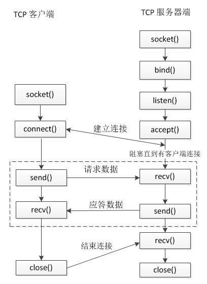

<!--
 * @Author: lizhiyuan
 * @Date: 2019-10-06 15:06:49
 * @LastEditors: lizhiyuan
 * @LastEditTime: 2021-01-07 15:19:54
-->
# libuv源码分析

## 1. socket阻塞模式和非阻塞模式

网络传输数据链路分析

```js
客户端A ------> write(进程被阻塞) -----> sys_write(系统调用,软中断) ------> 数据写入内核缓冲区(写缓冲区) -----> 网卡封包 ------->  路由器/交换机 ------->  服务器网卡发现数据到来产生硬中断(CPU进行系统调用,切换到内核态)-----> 内核放入该套接字的读缓冲区 ----> epoll_wait唤醒套接字进程
```



- connect 客户端连接的时候默认也是阻塞的
- accept 服务器接收连接的时候默认也是阻塞的
- send / write 发送数据是阻塞的
- recv / read 读取数据也是阻塞的

所谓的阻塞模式,就是当某个函数`执行成功的条件`当前不能满足的时候,该函数会阻塞当前执行的进程,感觉就是IO默认都是阻塞的...

而非阻塞即使某个函数的执行条件不能满足，该函数也不会阻塞当前的执行，而是立即返回.


send函数的本质并不是直接往网络上发送数据,而是将应用层发送缓冲区的数据拷贝到内核缓冲区(网卡缓冲区)

recv函数本质上也并不是从网络上收取数据，而只是将内核缓冲区中的数据拷贝到应用程序的缓冲区中

不同的程序进行网络通信的时候,发送的一方会将内核缓冲区的数据通过网络传输给接收方的内核缓冲区。假设应用程序A不断的调用send函数,这样数据会不断拷贝到对应的内核缓冲区，如果B端迟迟不调用recv函数,那么B的内核缓冲区被填满后,A的内核缓冲区也会被填满

1. 当socket是阻塞模式的的话，继续调用send/recv会导致程序阻塞,发的太快,接的很慢;发的很慢,接的很快都会阻塞

```
其实这个内核缓冲区就是TCP协议中的窗口概念
建立连接的时候，三次握手除了沟通序号之外,还要沟通窗口大小

// block_client 发出SYN 标记位, 发出自己的窗口大小 ,以及自己的序号 
11:52:35.907381 IP 127.0.0.1.40846 > 127.0.0.1.3000: Flags [S], seq 1394135076, win 43690, options [mss 65495,sackOK,TS val 78907688 ecr 0,nop,wscale 7], length 0

// block_server ACK + SYN   确认客户端的序号+1 ,发出自己的窗口大小以及自己的序号
20:32:21.261484 IP 127.0.0.1.3000 > 127.0.0.1.40846: Flags [S.], seq 1233000591, ack 1394135077, win 43690, options [mss 65495,sackOK,TS val 78907688 ecr 78907688,nop,wscale 7], length 0

// block_client ACK 确认服务器的序号 + 1  ,窗口大小从一个比较小的数值开始,告知服务器我的接收能力
11:52:35.907441 IP 127.0.0.1.40846 > 127.0.0.1.3000: Flags [.], ack 1233000592, win 342, options [nop,nop,TS val 78907688 ecr 78907688], length 0

// 开始正式传输数据,客户端发送10个字节给服务器,077-087 
11:52:35.907615 IP 127.0.0.1.40846 > 127.0.0.1.3000: Flags [P.], seq 1394135077:1394135087, ack 1233000592, win 342, options [nop,nop,TS val 78907688 ecr 78907688], length 10

// block_server 确认087已经发送成功
11:52:35.907626 IP 127.0.0.1.3000 > 127.0.0.1.40846: Flags [.], ack 1394135087, win 342, options [nop,nop,TS val 78907688 ecr 78907688], length 0

11:52:35.907785 IP 127.0.0.1.40846 > 127.0.0.1.3000: Flags [P.], seq 1394135087:1394135097, ack 1233000592, win 342, options [nop,nop,TS val 78907688 ecr 78907688], length 10
11:52:35.907793 IP 127.0.0.1.3000 > 127.0.0.1.40846: Flags [.], ack 1394135097, win 342, options [nop,nop,TS val 78907688 ecr 78907688], length 0
11:52:35.907809 IP 127.0.0.1.40846 > 127.0.0.1.3000: Flags [P.], seq 1394135097:1394135107, ack 1233000592, win 342, options [nop,nop,TS val 78907688 ecr 78907688], length 10
11:52:35.907814 IP 127.0.0.1.3000 > 127.0.0.1.40846: Flags [.], ack 1394135107, win 342, options [nop,nop,TS val 78907688 ecr 78907688], length 0
11:52:35.907839 IP 127.0.0.1.40846 > 127.0.0.1.3000: Flags [P.], seq 1394135117:1394135127, ack 1233000592, win 342, options [nop,nop,TS val 78907688 ecr 78907688], length 10
11:52:35.907853 IP 127.0.0.1.40846 > 127.0.0.1.3000: Flags [P.], seq 1394135127:1394135137, ack 1233000592, win 342, options [nop,nop,TS val 78907688 ecr 78907688], length 10
11:52:35.907880 IP 127.0.0.1.40846 > 127.0.0.1.3000: Flags [P.], seq 1394135147:1394135157, ack 1233000592, win 342, options [nop,nop,TS val 78907688 ecr 78907688], length 10
11:52:35.907896 IP 127.0.0.1.3000 > 127.0.0.1.40846: Flags [.], ack 1394135167, win 342, options [nop,nop,TS val 78907688 ecr 78907688], length 0
11:52:35.907920 IP 127.0.0.1.40846 > 127.0.0.1.3000: Flags [P.], seq 1394135177:1394135187, ack 1233000592, win 342, options [nop,nop,TS val 78907688 ecr 78907688], length 10
11:52:35.907924 IP 127.0.0.1.3000 > 127.0.0.1.40846: Flags [.], ack 1394135187, win 342, options [nop,nop,TS val 78907688 ecr 78907688], length 0
11:52:35.907938 IP 127.0.0.1.3000 > 127.0.0.1.40846: Flags [.], ack 1394135197, win 342, options [nop,nop,TS val 78907688 ecr 78907688], length 0
11:52:35.923799 IP 127.0.0.1.40846 > 127.0.0.1.3000: Flags [.], seq 1394135247:1394157135, ack 1233000592, win 342, options [nop,nop,TS val 78907704 ecr 78907688], length 21888
11:52:35.923840 IP 127.0.0.1.3000 > 127.0.0.1.40846: Flags [.], ack 1394157135, win 1365, options [nop,nop,TS val 78907704 ecr 78907688], length 0
```

可以知道的是block_server的窗口短期内慢慢增加，后面随着缓冲区数据积压越来越多，TCP的窗口会慢慢变小，最终为0

然后再发送的时候就会把自己的缓冲区也填满了

2. 当socket是非阻塞的时候,数据发不出去了，但是 send 函数不会阻塞，而是立即返回，返回值是 -1（Windows 系统上 返回 SOCKET_ERROR，这个宏的值也是 -1），此时得到错误码是 EWOULDBLOCK

3. 当socket是阻塞模式的时候,程序阻塞在recv函数中

4. 当socket是非阻塞模式的时候,如果当前无数据可读，recv 函数将立即返回，返回值为 -1，错误码为 EWOULDBLOCK


***总结一下:*** 

###  TCP发送方发送大量数据的处理方法(因为涉及到网络封包)

```
// send大量的数据
char szSendBuf[1024 * 64 * 10] = {0};
int iRet = send(sockClient, szSendBuf, sizeof(szSendBuf) , 0);

// 实际是没有任何问题的,TCP内核会将这些大量的数据拆分成多个包同时发送出去
// 但是读的时候就要while循环的将这些数据批量接收
while(1)
	{
	    char szRecvBuf[1024 * 64] = {0};
	    int iRet = recv(sockConn, szRecvBuf, sizeof(szRecvBuf), 0);
		total += iRet;
	    printf("iRet is %u, total %u\n", iRet, total);
		getchar(); 
	}
// 发送的时候发送一次就可以了
// 接收的时候需要多次的接收
// 底层的TCP内核程序会将这些数据拆成包发送....
// TCP因为会拆包所以，数据的边界是不清晰的，需要应用层的协议去定义如何去拆包    
```


###  TCP发送方发送过小数据的处理方法(因为涉及到网络封包)

TCP使用以下条件来决定何时在收到的数据包上发送ACK

1. 如果在延迟(200ms)计时器过期之前收到了第二个数据包,则发送ACK
2. 如果在收到第二个数据包且延迟计时器过期之前,有于ACK相同方向发送的数据,则会将该ACK与数据段合并立即发送
3. 当延迟计时器过期的时候,发送ACK

可以看到,无论任何时候,ACK的包都需要及时的发送,发送是为了保证TCP的包的可靠性,需要接收方不断的确认接收到的数据...

在此基础上,为了避免不断的发送ACK,启动了延迟ACK


### TCP发送方发送数据过快的处理方法(客户端发送的总是很快,但服务器接收的速度总是很慢)

对比文件,写入磁盘的速度远比读取数据慢的多了,所以,一切都是为了避免写入的数据过快来不及处理

NodeJS中为了不积压,pipe当可写流返回false的时候,可读流停止..可写流drain的时候再恢复可读流;另外hightWaterMark也定义了可读流从底层读取数据的大小,精准的控制这个大小可避免可读流读的太快...

在TCP中, 增加了窗口的概念,接收方将自己的`窗口大小`发送给发送方,发送方根据接收方的窗口大小决定发送的速度

我的理解并不是在一个ACK之前,可发送的最大的数据包,而是在未达到窗口大小前,发送放可一直处于不断发送阶段,发送过程不能停....当达到窗口大小为0的时候,发送过程终止....

自动调整窗口大小就是TCP`流量控制`

###  TCP发送方发送数据延时/丢失的处理方法(也只可能存在于网络中)

```
```


## 2. 实现一个简单的eventloop


实例,定时,打印hello world 每10秒

```
int print(struct aeEventLoop *loop, long long id, void *clientData)
{
    printf("%lld - Hello, World\n", id);
    return -1;
}

int main(void)
{
    aeEventLoop *loop = aeCreateEventLoop(0);
    int i;
    for (i = 0; i < 10; i ++) {
        aeCreateTimeEvent(loop, i*1000, print, NULL, NULL);
    }
    aeMain(loop);
    aeDeleteEventLoop(loop);
    return 0;
}

```


